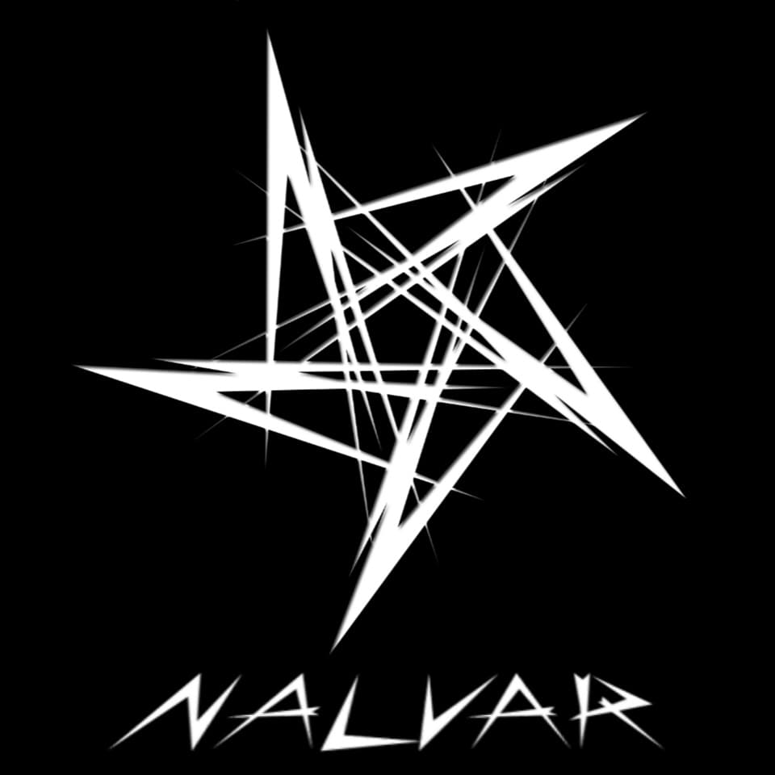

<div align="center">
  
  <p align="center">
    
    
<a href="#"></a>
</p>
  <p align="center">
<a href=https://github.com/NALVAR47"></a>
</p>
</div>
<p align="center">
Project created by <a href="https://github.com/NALVAR47">NALVAR</a> to make it public
    <br>
       | © |
        Reserved |
    <br> 
</p>

## Setup
<div align="center">

  ### Simple Method
  
[](https://heroku.com/deploy?template=https://github.com/NALVAR47/NALVAR_2.0 ) 
  
[](https://replit.com/@Chunkindepadayali/LizaMwol?v=1)
  
### The Hard Method
```js
GET QR
$ apt install git
$ apt install nodejs --fix-missing
$ git clone https://github.com/NALVAR47/NALVAR_2.0 
$ cd NALVAR_2.0 
$ npm install @adiwajshing/baileys
$ npm install chalk
$ node Liza.js
```
      
```js
SETUP
$ git clone https://github.com/NALVAR47/NALVAR_2.0 
$ cd NALVAR_2.0 
$ npm i
$ node Liza.js
```

----

  <p align="center">
  <a href="https://github.com/NALVAR47/NALVAR_2.0 ">
    
<a href="https:https://github.com/NALVAR47?tab=followers">

<p align="center">
<a href="https://github.com/NALVAR47/followers"
</a>
<a href="https://github.com/NALVAR47/NALVAR_2.0 /stargazers/"></a>
<a href="https://github.com/NALVAR47/NALVAR_2.0 /network/members"></a>
<a href="https://github.com/NALVAR47/NALVAR_2.0 /watchers"></a>
</p>

<p align="center">
<p>&nbsp;</p>
    

       
  
  </div>
 
  
  [](https://wa.me/+918590479072?text=Creator+of+Nalvar)
                     
### ⚠️ Warning! 
```
Due to Userbot; Your WhatsApp account may be banned.
This is an open source project, you are responsible for everything you do. 
Absolutely, Nalvar executives do not accept responsibility.
By establishing the NALVAR_2.0, you are deemed to have accepted these responsibilities.
```

## Developers
  <div align="center">
    
[](https://github.com/NALVAR47) | [](https://github.com/farhan-dqz) | [](https://github.com/TOXIC-DEVIL) |  [](https://github.com/AI-VIKI) | [](https://github.com/afnanplk) 
----|----|----|----|----
[NALVAR47](https://github.com/NALVAR47) | [farhan-dqz](https://github.com/farhan-dqz) | [TOXIC-DEVIL](https://github.com/TOXIC-DEVIL) | [TOXIC4L!3N](https://github.com/AI-VIKI) | [afnanplk](https://github.com/afnanplk) 
Modifiying as public | Developer, Base, Bug Fixes, Modules| Re-Developer, Bug Fixes, Modules, Commits |  Modifiying  as   public | Bug Fixes, Modules 
  </div>
    


## License
This project is protected by `GNU General Public Licence v3.0` license.

### Disclaimer
`WhatsApp` name, its variations and the logo are registered trademarks of Facebook. We have nothing to do with the registered trademark
